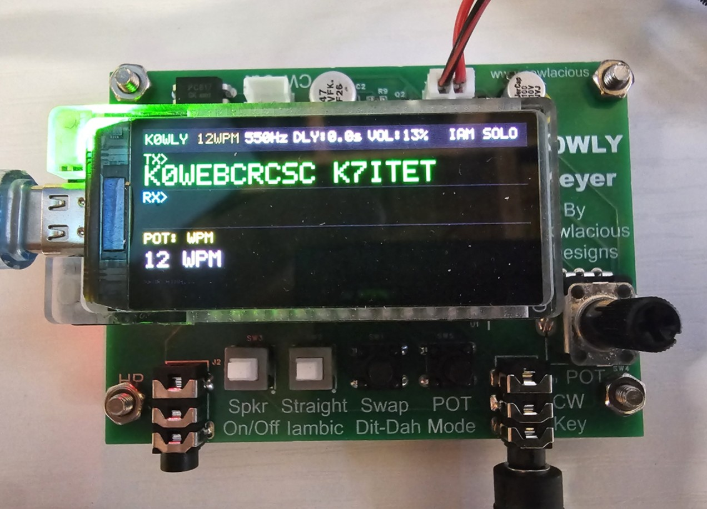
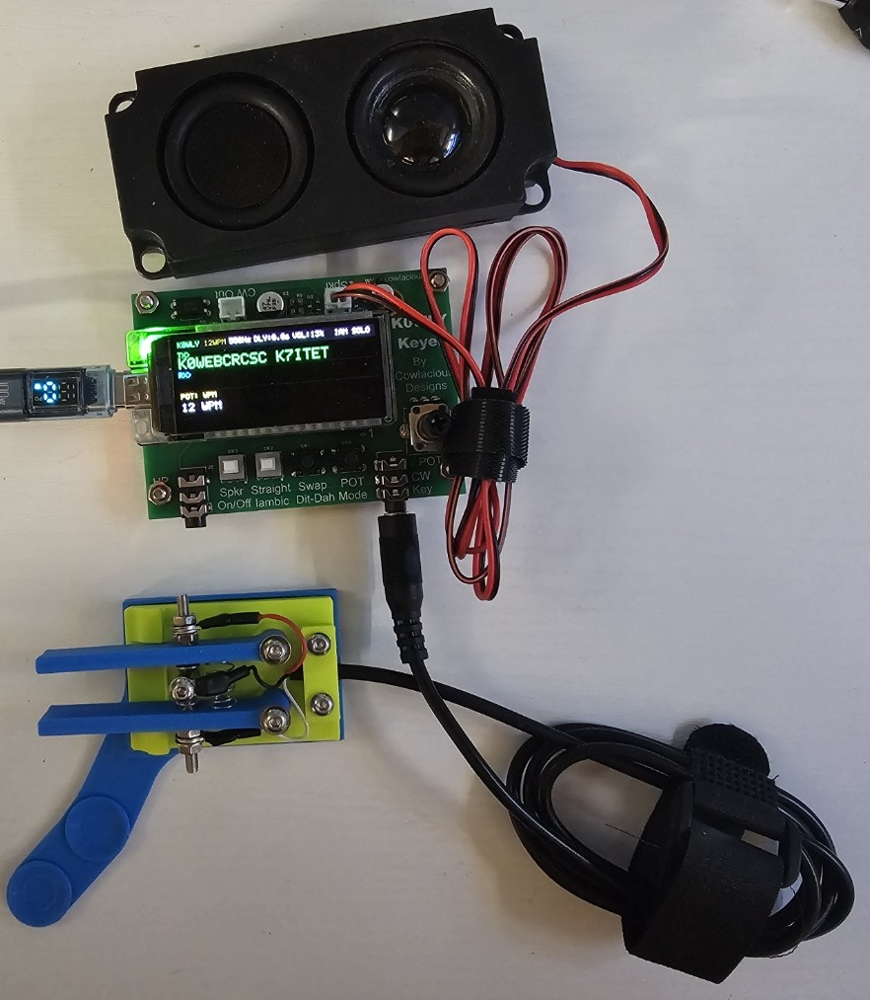

# K0WLY Two-Way CW Keyer

[](https://ohwr.org/cern_ohl_w_v2.txt)
[](https://creativecommons.org/licenses/by/4.0/)
[](https://www.espressif.com/en/products/socs/esp32-s3)
[](https://www.arduino.cc/)

A full-featured two-way CW (Morse code) keyer built on the LilyGO T-Display S3 AMOLED board, featuring peer-to-peer WiFi communication via ESP-NOW, real-time Morse decoding, and a beautiful 1.91" AMOLED display.
A video of the keyer and how it works can be found here:  https://youtu.be/8L7SKNOl4is?si=q5VC2bDrw9pgBQYe

I will be added the keyer as a kit on my www.cowlacious.com site soon, as I have had several people ask if one is available.

**Designed and built by K0WLY — Saratoga Springs, Utah — Grid DN40**





---

## Features

- **Iambic Mode A keyer** with adjustable speed (5–40 WPM)
- **Straight key mode** selectable via hardware switch
- **Adjustable sidetone frequency** (400–900 Hz) — each unit independent
- **Logarithmic volume control** via PWM, works for speaker and headphones
- **Head copy delay** (0–3 seconds) for incoming character display
- **Automatic peer-to-peer WiFi pairing** via ESP-NOW — no router needed
- **Two-way CW communication** — transmit and receive simultaneously
- **Real-time Morse decoding** — letters, numbers, punctuation, and prosigns
- **Scrolling TX/RX display** on 1.91" AMOLED (536×240)
- **Farnsworth spacing** — two-speed CW for learning (4–40 WPM effective, independent of character speed)
- **Adjustable word gap spacing** (off or 4–9 dits) for display readability
- **Non-volatile settings** — survives power cycles
- **Single pot** with mode cycling for all parameter adjustments
- **Frame buffer display** — instantaneous screen updates, no glitch

---

## Hardware

### Bill of Materials

| Component | Value | Notes |
|---|---|---|
| MCU Board | LilyGO T-Display S3 AMOLED | ESP32-S3R8, 1.91" AMOLED |
| Optocoupler | PC817 | Radio key line isolation |
| Transistors | 2N4401 × 2 | Speaker + headphone audio |
| Base resistors | 470Ω × 2 | GPIO13 to transistor bases |
| Pull-up resistors | 10kΩ × 2 | DIT/DAH paddle inputs |
| Key mode resistor | 100kΩ | GPIO15 pull-up |
| Headphone pull-up | 1kΩ | Headphone transistor collector |
| Coupling cap | 47µF bi-polar | Headphone output only |
| Headphone resistor | 100Ω | Series protection |
| Pot | 10–20kΩ linear | Parameter adjustment |
| Speaker | 8Ω | Direct connection, no cap needed |
| 3.5mm jack | TRS | Headphone output |

### GPIO Pin Assignments

| Function | GPIO | Notes |
|---|---|---|
| DIT Paddle | GPIO11 | Active LOW, ext 10kΩ pull-up |
| DAH Paddle | GPIO10 | Active LOW, ext 10kΩ pull-up |
| Key Out | GPIO12 | HIGH=keyed, drives PC817 |
| Sidetone | GPIO13 | PWM → 470Ω → 2N4401 |
| Pot (ADC) | GPIO14 | Wiper of 10–20kΩ pot |
| Key Mode | GPIO15 | SPST: open=iambic, GND=straight key |
| Paddle Reverse | GPIO16 | PBNO momentary button |
| Pot Mode Select | GPIO39 | PBNO momentary button |

### Audio Circuit Notes

**Speaker circuit** — direct connection, no coupling capacitor:
```
3.3V ──── Speaker ──── Collector
                           │
GPIO13 ── 470Ω ── Base  2N4401 #1
                           │
                       Emitter ──── GND
```

**Headphone circuit** — separate transistor with coupling cap:
```
3.3V ──── 1kΩ ──── Collector
                       │
                   +47µF- ──── 100Ω ──── 3.5mm tip
                       │                 3.5mm sleeve ──── GND
GPIO13 ── 470Ω ── Base  2N4401 #2
                           │
                       Emitter ──── GND
```

> **Note:** The speaker connects directly without a coupling capacitor. A coupling cap in series with the speaker will block all audio. The headphone output uses a separate transistor with its own 3.3V pull-up and a 47µF bi-polar coupling cap to block DC.

---

## Firmware

### Requirements

- [PlatformIO](https://platformio.org/) with VS Code
- ESP32 Arduino framework 2.0.x

### platformio.ini

```ini
[env:t_display_s3_amoled]
platform = espressif32
board = esp32-s3-devkitm-1
framework = arduino
board_build.mcu = esp32s3
board_build.f_cpu = 240000000L
board_build.flash_size = 16MB
board_build.flash_mode = dio
board_build.psram_type = opi
board_upload.flash_size = 16MB
monitor_speed = 115200
build_flags =
    -DARDUINO_USB_CDC_ON_BOOT=1
    -DBOARD_HAS_PSRAM
lib_deps =
    https://github.com/Xinyuan-LilyGO/LilyGo-AMOLED-Series
    https://github.com/moononournation/Arduino_GFX#v1.4.7
```

### Building and Flashing

1. Clone this repository
2. Open the `firmware/` folder in VS Code with PlatformIO
3. Connect the T-Display S3 AMOLED via USB
4. Hold BOOT button, plug in USB, release BOOT
5. Click Upload in PlatformIO

---

## Operation

### Display Layout

```
┌─────────────────────────────────────────────────────────────────────┐
│ K0WLY   20WPM  700Hz  DLY:0.0s  VOL:50%       IAM  SOLO           │  ← Header
├─────────────────────────────────────────────────────────────────────┤
│ TX> CQ CQ CQ DE K0WLY K0WLY K                                      │  ← Outgoing (green)
├─────────────────────────────────────────────────────────────────────┤
│ RX> TNX FER CALL OM 73 DE                                           │  ← Incoming (cyan)
├─────────────────────────────────────────────────────────────────────┤
│ POT: WPM                                                            │
│ 20 WPM                                                              │  ← Status area
│ SEARCHING...                                                        │
└─────────────────────────────────────────────────────────────────────┘
```

### Parameter Adjustment

| Button Action | Result |
|---|---|
| Short press | Cycle to next parameter: WPM → FREQ → DELAY → VOL |
| Long press (1 sec) | Enter/exit edit mode for current parameter |
| Turn pot (in edit) | Adjust value — saves to flash in real time |

### Two-Way Operation

1. Power on both units — they auto-discover each other via ESP-NOW
2. Header changes from **SOLO** to **DUAL** when paired
3. Each unit hears all CW at its own sidetone frequency
4. Incoming decoded characters appear on the RX line (cyan)
5. Head copy delay (0–3s) lets you practice mental decoding

### Morse Code Coverage

Letters A–Z, numbers 0–9, punctuation (. , ? / ( ) : ; - ' " @ & ! _),
and prosigns: **+** = AR, **=** = BT, **~** = SK

---

## CW Timing Standard

**PARIS standard (ITU-R M.1677-1)**

| Element | Duration |
|---|---|
| Dit | 1 × (1200/WPM) ms |
| Dah | 3 × (1200/WPM) ms |
| Inter-element gap | 1 × (1200/WPM) ms |
| Character gap | 3 × (1200/WPM) ms |
| Word gap | 7 × (1200/WPM) ms |

---

## Repository Structure

```
k0wly-cw-keyer/
├── firmware/          # PlatformIO project
│   ├── src/
│   │   └── main.cpp
│   └── platformio.ini
├── hardware/          # Schematic and PCB files (KiCad)
│   ├── schematic/
│   └── pcb/
├── docs/              # Documentation
│   └── K0WLY_CW_Keyer_Manual.docx
├── LICENSE            # CERN-OHL-W v2 (hardware + firmware)
├── LICENSE-DOCS       # CC BY 4.0 (documentation)
├── NOTICE             # Required attribution notice
├── CONTRIBUTING.md
├── CHANGELOG.md
└── README.md
```

---

## License

**Hardware and Firmware:** Licensed under the
[CERN Open Hardware Licence Version 2 - Weakly Reciprocal (CERN-OHL-W v2)](LICENSE).

**Documentation:** Licensed under
[Creative Commons Attribution 4.0 International (CC BY 4.0)](LICENSE-DOCS).

Copyright © 2026 K0WLY (Carl Cowley) — Saratoga Springs, Utah

Attribution to **K0WLY** must be retained on all copies and derivatives.

---

## Contributing

See [CONTRIBUTING.md](CONTRIBUTING.md) for guidelines.

## Changelog

See [CHANGELOG.md](CHANGELOG.md) for version history.

---

*73 de K0WLY — dit dit*
